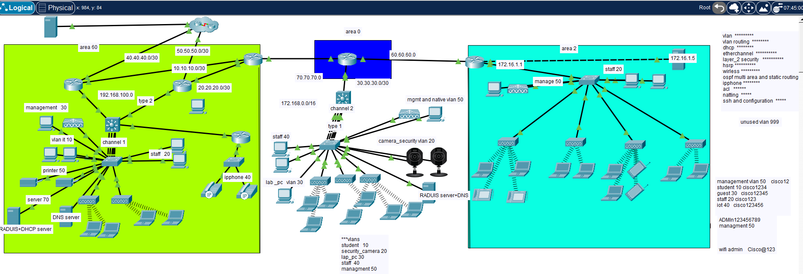
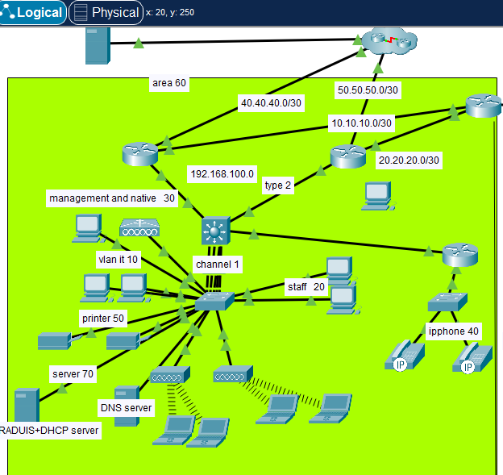
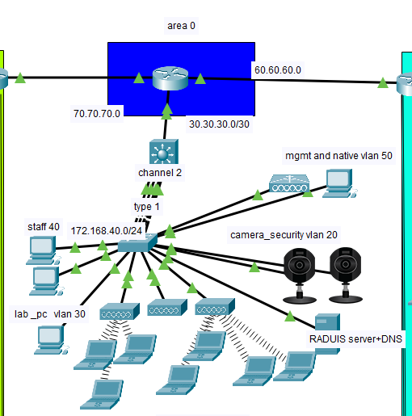
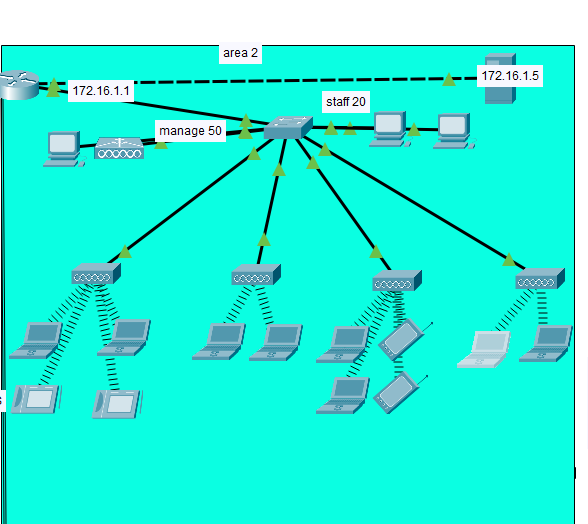

# 🎓 University Network Project 🌐
Cisco Packet Tracer project simulating a university campus network with three main buildings (Administration, Labs, Dorms). Includes CCNA fundamentals and advanced CCNP-level configurations such as VLANs, OSPF multi-area, EtherChannel, ACLs, HSRP, AAA with RADIUS, and wireless (WLC & AP). Designed and implemented by Shahd Yesen.

## 📌 Overview
This project designs and implements a *university campus network* with *three main buildings*:  
- *Administration*  
- *Labs*  
- *Dorms (Student Housing)*  

The network is connected to an *ISP* through the administration building and includes an *external server* for services.  
Redundancy, monitoring, and high availability are also considered in the design.

---

## 🏢 Network Design

### Administration Building (192.168.0.0/16)
- VLAN 10 – IT  
- VLAN 20 – Staff  
- VLAN 30 – Management  
- VLAN 40 – IP Phones  
- VLAN 50 – Printers  
- VLAN 70 – Servers  
- VLAN 999 – Unused  

### Labs Building (172.168.0.0/16)
- VLAN 10 – Students  
- VLAN 20 – Security Cameras  
- VLAN 30 – Lab PCs  
- VLAN 40 – Staff  
- VLAN 50 – Management  
- VLAN 999 – Unused  

### Dorms Building (172.16.0.0/16)
- VLAN 10 – Students  
- VLAN 20 – Staff  
- VLAN 30 – Guest  
- VLAN 40 – IoT Devices  
- VLAN 50 – Management  
- VLAN 1 – Server  
- VLAN 999 – Unused  

---

## ⚙ Implemented Configurations

- *VLANs*: Configured for segmentation of departments and services.  
- *Inter-VLAN Routing*: Enabled via Layer 3 devices.  
- *DHCP: Configured on **server, router, and WLC* for dynamic IP allocation.  
- *EtherChannel*: Implemented for link aggregation and redundancy.  
- *Layer 2 Security*:  
  - DHCP Snooping  
  - Dynamic ARP Inspection  
  - BPDU Guard  
  - PortFast  

- *Wireless Configuration*:  
  - WLC + Access Points  
  - SSIDs mapped to VLANs  
  - AAA with RADIUS server  
  - DHCP integration  
  - WLANs for different user groups  
  - *SNMP + SNMP Trap enabled on WLC* for monitoring and alerts  

- *Routing*:  
  - Default static route to ISP  
  - OSPF multi-area for internal routing  

- *VoIP*: IP Phones integrated into VLAN 40 (Administration).  

- *Access Control Lists (ACLs)*: Applied for traffic filtering and security.  

- *NAT*: Configured for Internet access.  

- *SSH*: Secure remote management configured.  

- *Basic Security*:  
  - Password protection  
  - Session timeout limits  

- *Redundancy*:  
  - Multiple links with EtherChannel  
  - HSRP configured for gateway redundancy (Note: Packet Tracer froze during testing)  

---

## 🖼 Network Topology

### Main Topology

### Administration Building

### Labs Building

### Dorms Building

---

## 🚀 Skills Demonstrated
- *CCNA Fundamentals* (VLANs, Inter-VLAN Routing, DHCP, ACLs, NAT, SSH, Wireless)  
- *CCNP Concepts* (OSPF Multi-area, EtherChannel, HSRP, AAA with RADIUS, SNMP)  
- *Network Security* (Layer 2 Security, ACLs, Redundancy)  
- *Network Monitoring & Management* (SNMP, RADIUS, WLC)  

---

## 🛠 Tools
- Cisco Packet Tracer  

---

## 📝 Notes
- Packet Tracer was used for simulation.  
- Some advanced features (like HSRP failover) may not fully function due to tool limitations.
- All device passwords (console, VTY, enable, etc.) are set to *cisco*.

---

## 🔮 Future Enhancements
- Full integration of redundancy and failover testing.  
- Advanced monitoring tools (SNMP traps, Syslog, NetFlow).  
- Implementation on real hardware for advanced testing.  

---

## 👩‍💻 Author

Designed and implemented by *Shahd Yesen**

